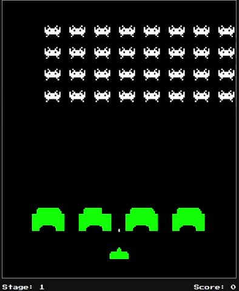

<!-- Improved compatibility of back to top link: See: https://github.com/othneildrew/Best-README-Template/pull/73 -->
<a id="readme-top"></a>

<!-- PROJECT LOGO -->
<br />
<div align="center">
  

<h3 align="center">👾 Space Invaders Clone</h3>

  <p align="center">
    A high-fidelity clone of the classic arcade game <em>Space Invaders</em>, built from scratch using vanilla web technologies — no frameworks.
  </p>
</div>


<!-- TABLE OF CONTENTS -->
<details>
  <summary>Table of Contents</summary>
  <ol>
    <li>
      <a href="#about-the-project">About The Project</a>
      <ul>
        <li><a href="#built-with">Built With</a></li>
      </ul>
    </li>
    <li>
      <a href="#getting-started">Getting Started</a>
      <ul>
        <li><a href="#prerequisites">Prerequisites</a></li>
        <li><a href="#installation">Installation</a></li>
      </ul>
    </li>
    <li><a href="#usage">Usage</a></li>
    <li><a href="#acknowledgments">Acknowledgments</a></li>
  </ol>
</details>


<!-- ABOUT THE PROJECT -->
## About The Project

This project is a high-fidelity clone of the classic arcade game *Space Invaders*, developed from scratch using vanilla web technologies. It features pixel-art sprites, destructible barriers, progressive difficulty, retro sound effects, and a full game cycle — all without any external frameworks or libraries.

**Key Features:**
* **Fluid Mechanics:** Responsive player movement and firing system.
* **Progressive Difficulty:** Alien horde with multiple levels, faster movement, and increased firing rates as you advance.
* **Pixel-Art Sprites:** Custom sprite animations for enemies (idle/movement), player (active/death), and explosion effects.
* **Destructible Barriers:** Protective barriers that degrade dynamically when hit by player or enemy projectiles.
* **Classic Soundscape:** Retro sound effects for shooting, explosions, crashes, and alien movement.
* **Full Game Cycle:** Main menu, high score tracking, gameplay stages, and Game Over states.

**Controls:**
* **Left/Right Arrow Keys:** Move the player ship.
* **Spacebar:** Fire projectile.
* **Enter:** Navigate and select options in the menu.

<p align="right">(<a href="#readme-top">back to top</a>)</p>


### Built With

* [![HTML5][HTML5-badge]][HTML5-url]
* [![CSS3][CSS3-badge]][CSS3-url]
* [![JavaScript][JavaScript-badge]][JavaScript-url]

<p align="right">(<a href="#readme-top">back to top</a>)</p>


<!-- GETTING STARTED -->
## Getting Started

To get a local copy up and running, follow these simple steps.

### Prerequisites

All you need is a modern web browser. No Node.js, npm, or build tools required.

### Installation

1. Clone the repository:
   ```sh
   git clone https://github.com/jerichd4c/space-invaders-clone.git
   ```
2. Open the project folder in your code editor (e.g., VS Code).
3. Open `index.html` directly in your browser, or use the **Live Server** extension for hot-reloading.

<p align="right">(<a href="#readme-top">back to top</a>)</p>


<!-- USAGE EXAMPLES -->
## Usage

Simply launch the game in your browser. Use the arrow keys to move, spacebar to shoot, and Enter to navigate menus. Survive as many waves as possible — the aliens get faster and more aggressive with each level!

<p align="right">(<a href="#readme-top">back to top</a>)</p>


<!-- ACKNOWLEDGMENTS -->
## Acknowledgments

* [Classic Gaming — Space Invaders Sounds](https://classicgaming.cc/classics/space-invaders/sounds)
* [The Spriters Resource](https://www.spriters-resource.com/)
* [Aseprite](https://www.aseprite.org/)

<p align="right">(<a href="#readme-top">back to top</a>)</p>


<!-- MARKDOWN LINKS & IMAGES -->
[contributors-shield]: https://img.shields.io/github/contributors/jerichd4c/space-invaders-clone.svg?style=for-the-badge
[contributors-url]: https://github.com/jerichd4c/space-invaders-clone/graphs/contributors
[forks-shield]: https://img.shields.io/github/forks/jerichd4c/space-invaders-clone.svg?style=for-the-badge
[forks-url]: https://github.com/jerichd4c/space-invaders-clone/network/members
[stars-shield]: https://img.shields.io/github/stars/jerichd4c/space-invaders-clone.svg?style=for-the-badge
[stars-url]: https://github.com/jerichd4c/space-invaders-clone/stargazers
[issues-shield]: https://img.shields.io/github/issues/jerichd4c/space-invaders-clone.svg?style=for-the-badge
[issues-url]: https://github.com/jerichd4c/space-invaders-clone/issues
[linkedin-shield]: https://img.shields.io/badge/-LinkedIn-black.svg?style=for-the-badge&logo=linkedin&colorB=555
[linkedin-url]: https://linkedin.com/in/linkedin_username
[HTML5-badge]: https://img.shields.io/badge/HTML5-E34F26?style=for-the-badge&logo=html5&logoColor=white
[HTML5-url]: https://developer.mozilla.org/en-US/docs/Web/HTML
[CSS3-badge]: https://img.shields.io/badge/CSS3-1572B6?style=for-the-badge&logo=css3&logoColor=white
[CSS3-url]: https://developer.mozilla.org/en-US/docs/Web/CSS
[JavaScript-badge]: https://img.shields.io/badge/JavaScript-F7DF1E?style=for-the-badge&logo=javascript&logoColor=black
[JavaScript-url]: https://developer.mozilla.org/en-US/docs/Web/JavaScript